# INTEGRATED ENGINEERING TEAM PROJECT GROUP 12

### [Visit our E-Portfolio](https://sites.google.com/view/ietpgroup12)
## [E-commerce Website](http://ietpgroup12.42web.io/)

# ====== FRONT-END =======

- Responsive Layout
- Shopping Cart, Wishlist, Product Reviews
- Product attributes: cost price, stock, size...
- Upload manager: banner, images,..
- Newsletter management
- Contact forms with the real-time notification (Laravel Pusher)
- Related Products, Recommendations for you in our categories
- A Product search form
- Laravel Socialite implement(Facebook, Google & Twitter) & Customer login
many more......

## ======= ADMIN =======

- Admin roles, permission
- Product manager
- Media manager using [unisharp](https://github.com/UniSharp/laravel-filemanager) laravel file manager
- Banner manager
- Order management
- Category management
- Review Management
- User Management
- System config: email setting, info shop, maintain status,...
- Line Chart & Pie chart ...
- Real time message & notification
- Profile Settings
Many more....

## ======= USER DASHBOARD =======

- Order management
- Review Management
- Profile Settings

# Screenshots

## users views
### Home page
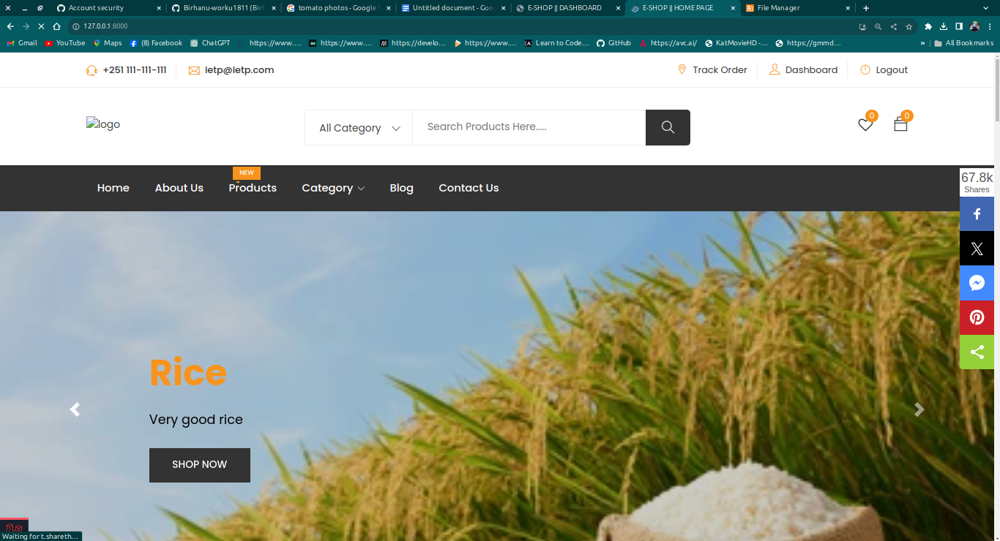
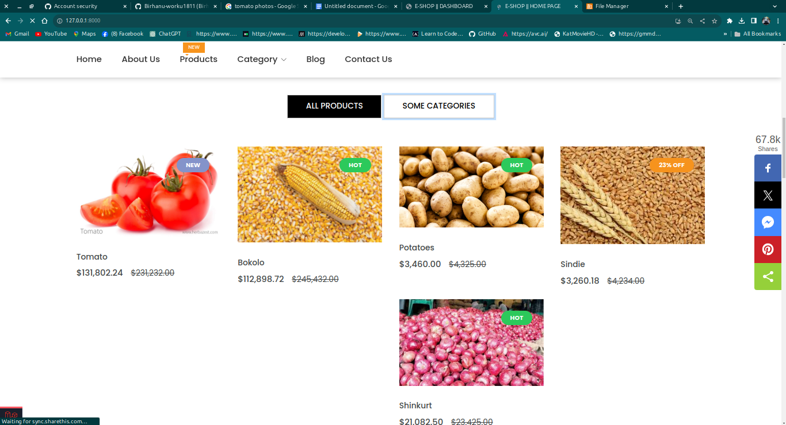
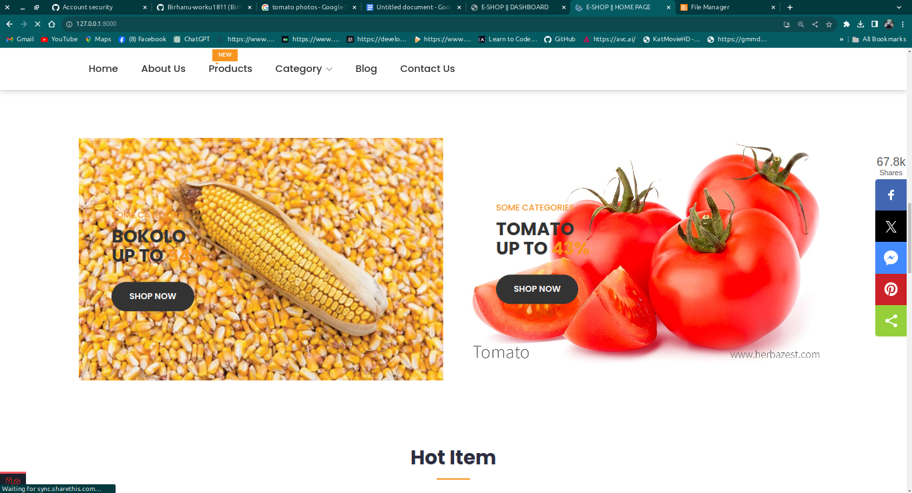
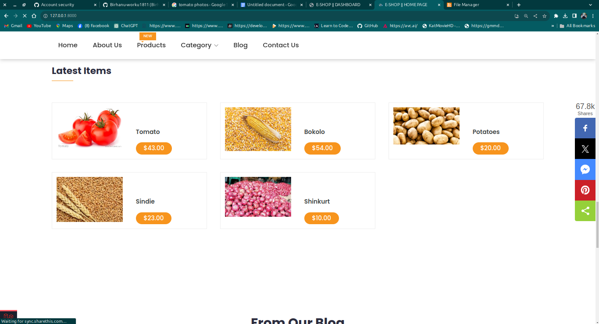

### Product page
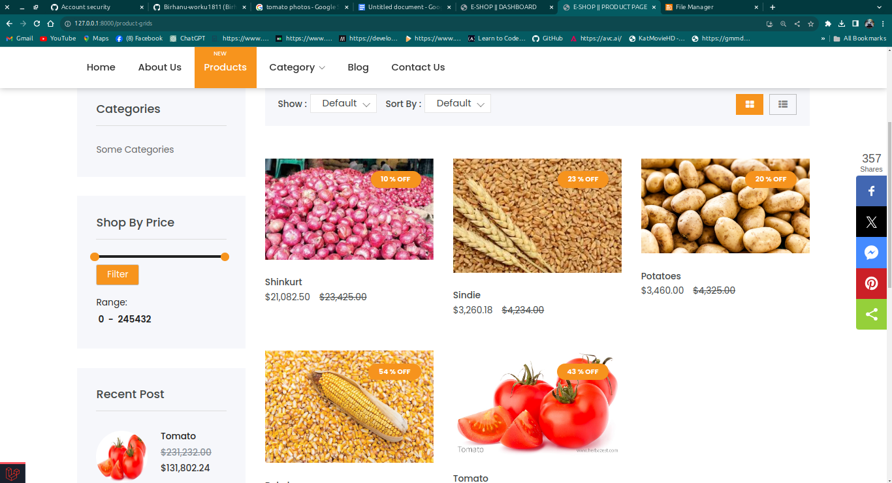
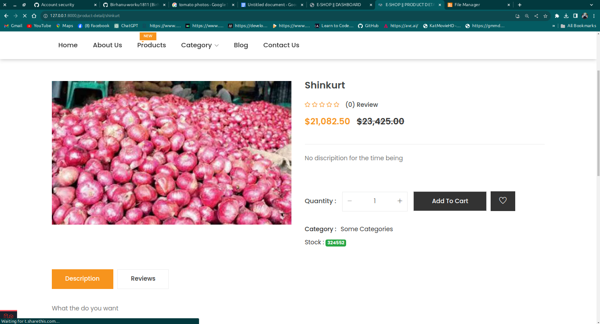
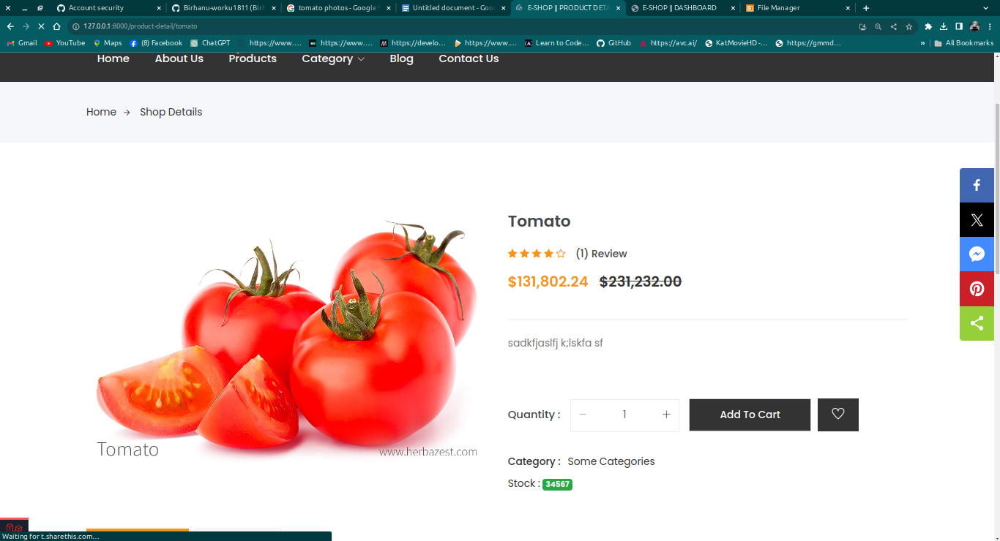

### Cart page

### Checkout page
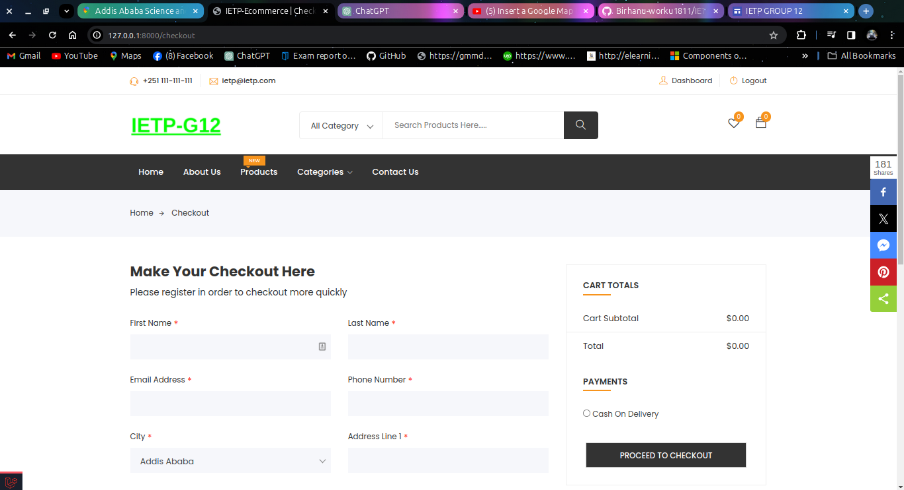

### Order page
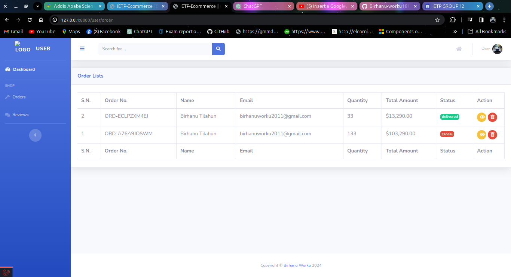

### Contact page
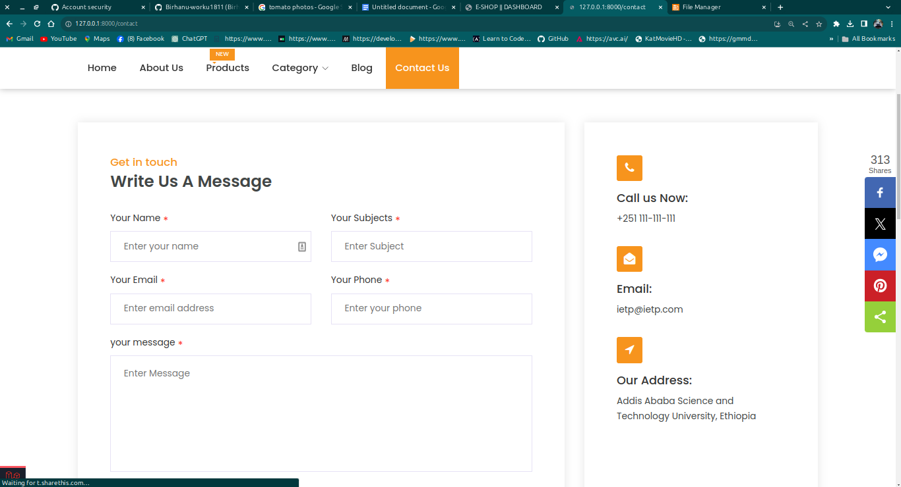

## Admin views

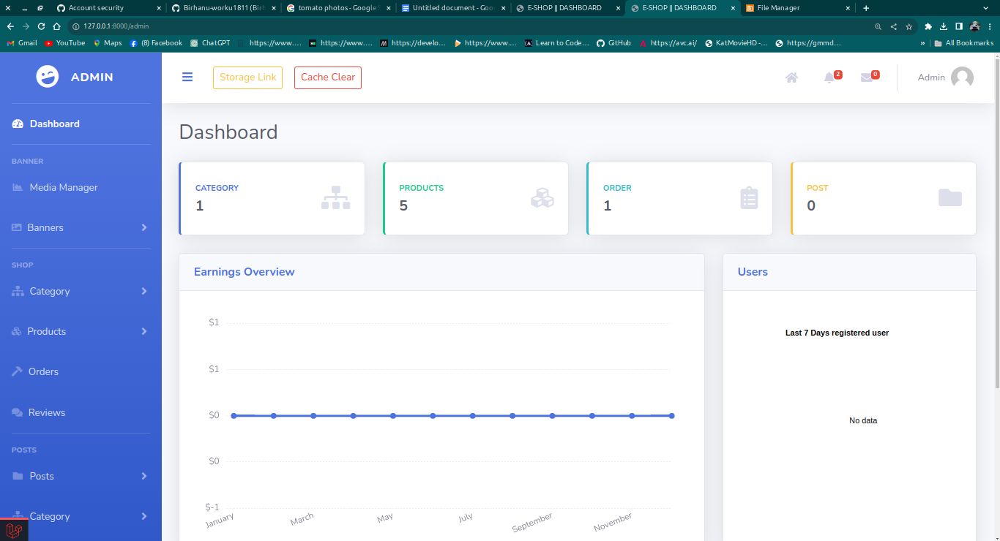
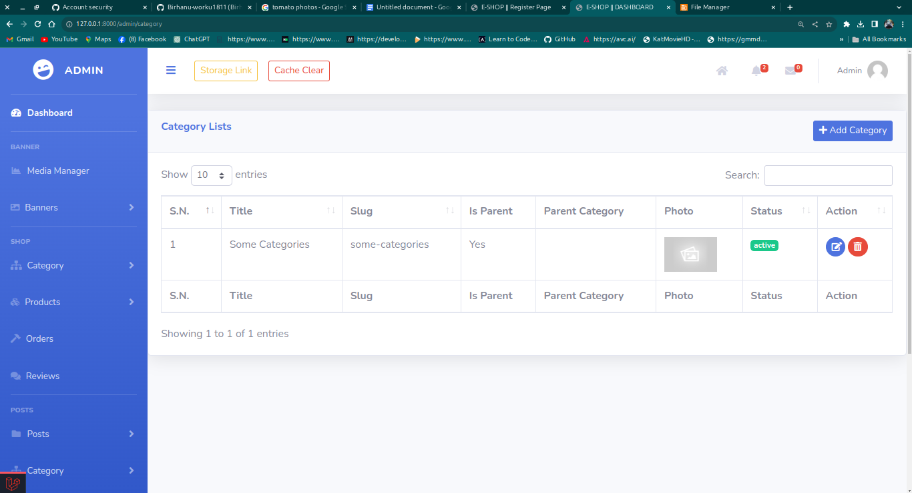
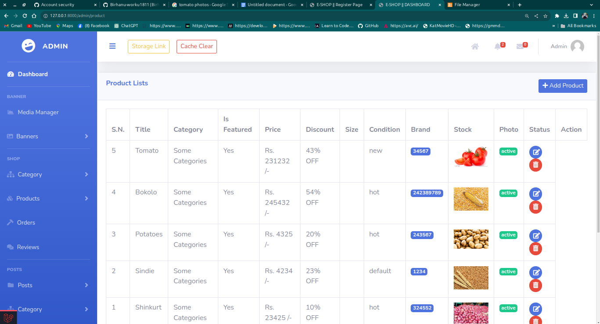

## Mobile views

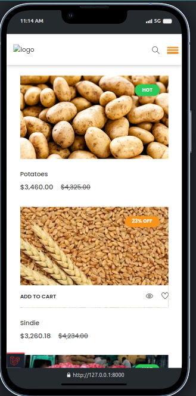

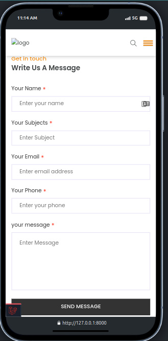
