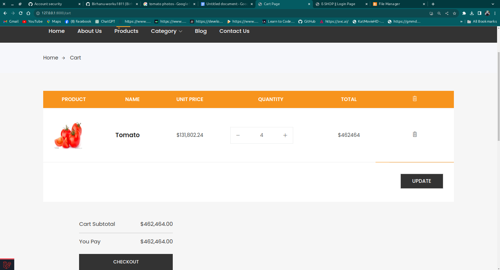

# INTEGRATED ENGINEERING TEAM PROJECT GROUP 12

### [Visit our E-Portfolio](https://sites.google.com/view/ietpgroup12)
## [E-commerce Website](link)

# ====== FRONT-END =======

- Responsive Layout
- Shopping Cart, Wishlist, Product Reviews
- Product attributes: cost price, stock, size...
- Upload manager: banner, images,..
- Newsletter management
- Contact forms with the real-time notification (Laravel Pusher)
- Related Products, Recommendations for you in our categories
- A Product search form
- Laravel Socialite implement(Facebook, Google & Twitter) & Customer login
many more......

## ======= ADMIN =======

- Admin roles, permission
- Product manager
- Media manager using [unisharp](https://github.com/UniSharp/laravel-filemanager) laravel file manager
- Banner manager
- Order management
- Category management
- Review Management
- User Management
- System config: email setting, info shop, maintain status,...
- Line Chart & Pie chart ...
- Real time message & notification
- Profile Settings
Many more....

## ======= USER DASHBOARD =======

- Order management
- Review Management
- Profile Settings

## ======= INSTALLATION ======= 

# TEAM MEMBERS

| Name               | Student ID | Email                         |
|--------------------|------------|-------------------------------|
| ABELE MARU         | ETS1551/13 | SOFTWARE ENGINEERING          |
| BIRHANU WORKU      | ETS0279/13 | SOFTWARE ENGINEERING          |
| YILIKAL SUDI       | ETS1319/13 | ELECTRICAL ENGINEERING        |
| ASAYEHEGN ABERA    | ETS0159/13 | ELECTRICAL ENGINEERING        |
| BERSABETH TERAMAJE | ETS0228/13 | CIVIL ENGINEERING             |
| NAOL EJO           | ETS0963/13 | CIVIL ENGINEERING             |
| SAMUEL ALEMAYEHU   | ETS1128/13 | ELECTROMECHANICAL ENGINEERING |
| NAHOM WALELIGN     | ETS0949/13 | ELECTROMECHANICAL ENGINEERING |
| KIDUS MENGISTU     | ETS0727/13 | MECHANICAL ENGINEERING        |
| DAWIT TESFAYE      | ETS0368/13 | MECHANICAL ENGINEERING        |
| FILAGOT DANIEL     | ETS0510/13 | CHEMICAL ENGINEERING          |

# Screenshots

## users views
### Home page

### Product page

### Cart page

### Checkout page

### Order page

### Contact page

## Admin views

## Mobile views

